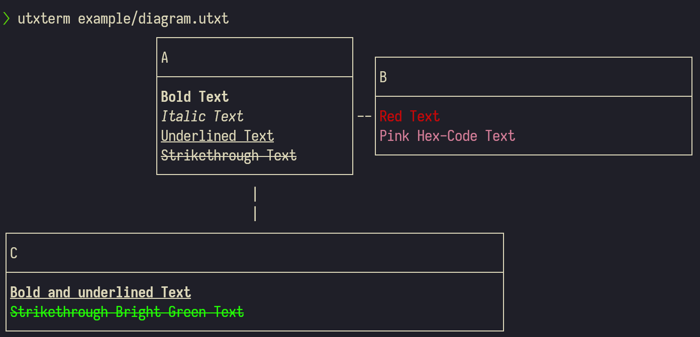

# utxterm

Render unicode puml diagrams in your terminal with color.

## Example

The following example can be found in the `example/` directory.

Consider the following plantuml file: `diagram.puml`

```
@startuml

object A {
    <b>Bold Text</b>
    <i>Italic Text</i>
    <u>Underlined Text</u>
    <s>Strikethrough Text</s>
}

object B {
    <color:red>Red Text</color>
    <color:#D27E99>Pink Hex-Code Text</color>
}

object C {
    <b><u>Bold and underlined Text</u></b>
    <color:brightgreen><s>Strikethrough Bright Green Text</s></color>
}

A -right-> B
A -down-> C

@enduml
```

The file could be rendered using plantuml into a unicode file via
`java -jar plantuml.jar --format utxt example/diagram.puml`.

```
                    ┌─────────────────────────┐                                             
                    │A                        │  ┌─────────────────────────────────────────┐
                    ├─────────────────────────┤  │B                                        │
                    │<b>Bold Text</b>         │  ├─────────────────────────────────────────┤
                    │<i>Italic Text</i>       │--│<color:red>Red Text</color>              │
                    │<u>Underlined Text</u>   │  │<color:#D27E99>Pink Hex-Code Text</color>│
                    │<s>Strikethrough Text</s>│  └─────────────────────────────────────────┘
                    └─────────────────────────┘                                             
                                 |                                                          
                                 |                                                          
┌─────────────────────────────────────────────────────────────────┐                         
│C                                                                │                         
├─────────────────────────────────────────────────────────────────┤                         
│<b><u>Bold and underlined Text</u></b>                           │                         
│<color:brightgreen><s>Strikethrough Bright Green Text</s></color>│                         
└─────────────────────────────────────────────────────────────────┘                         
```

Since unicode itself does not support color formatting, the bold, italic and 
color specifications remain as simple text.
`utxterm` can now be used to render it in the terminal.

```bash
utxterm example.utxt
# We could also use the puml file as input, if either a plantuml.jar file
# is present in the current working directory, or if the `plantuml` command 
# is founmd in the path
utxterm example.puml
```



## Dev Environment

- linting: `ruff`
- typechecking: `ty`
